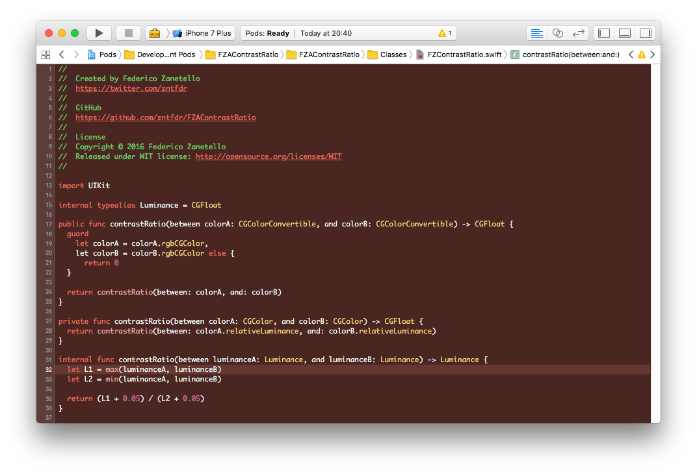

# 🎄 Christmas Theme 🎄
#### It's that time of the year!

## Sublime Text Installation ⛄
1. Locate your Sublime Text `Packages` folder by using the menu item `Preferences -> Browse Packages...`
2. [Download](https://github.com/zntfdr/Christmas/raw/master/Themes/Christmas.tmTheme) (Right click, save as) and put the `.tmTheme` file into a new folder named `Christmas - Color Theme`
2. Move the new folder into Sublime Text's `Packages` directory
3. Activate the `Christmas` theme in `Preferences -> Color Scheme...`
4. Enjoy! 🎁

## Vim Installation ⛄
1. [Download](https://github.com/zntfdr/Christmas/raw/master/Themes/Christmas.vim) (Right click, save as) and put the `.vim` file into `~/.vim/colors/`. You may have to create this folder
2. Add `syntax on` and `colorscheme Christmas` into your `vim ~/.vimrc`. You may have to create this file
3. Enjoy! 🎁

## Xcode Installation ⛄
1. [Download](https://github.com/zntfdr/Christmas/raw/master/Themes/Christmas.xccolortheme) (Right click, save as) and put the `.xccolortheme` file into `~/Library/Developer/Xcode/UserData/FontAndColorThemes/`. You may have to create this folder
2. Restart Xcode
3. Select the `Christmas` theme in Xcode `Preferences -> Fonts & Colors (Tab)`
4. Enjoy! 🎁

## Author 🎅🏻
[Federico Zanetello](https://github.com/zntfdr) ([@zntfdr](https://twitter.com/zntfdr))
