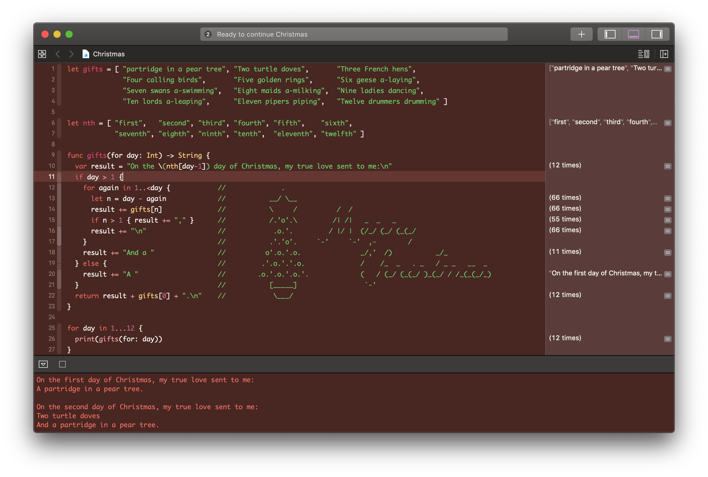

# 🎄 Christmas Xcode Theme 🎄
#### ⛄ It's that time of the year! 🎅🏻

## Installation

1. [Download](https://github.com/zntfdr/Christmas-Xcode-Color-Theme/raw/master/Christmas.xccolortheme) (Right click, save as) and move the .dvtcolortheme file into `~/Library/Developer/Xcode/UserData/FontAndColorThemes`. You may have to create the directory if it's not there yet.
2. Restart Xcode.
3. Select the *Christmas* theme in your Xcode 'Preferences -> Fonts & Colors (Tab)'.
4. Enjoy! 🎁

## Author
[Federico Zanetello](https://github.com/zntfdr) ([@zntfdr](https://twitter.com/zntfdr))
